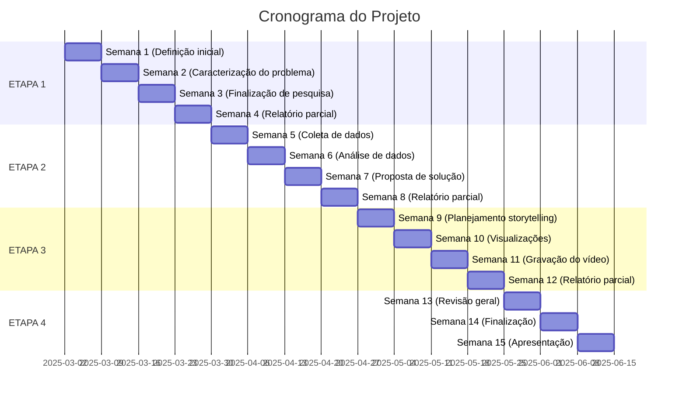

# Projeto Ciência de Dados - Mackenzie

## Visão Geral

Este cronograma detalha as atividades previstas para um projeto de análise de dados com duração de 120 dias, dividido em 4 etapas de 30 dias cada.

## ETAPA 1 – Planejamento Inicial (30 dias)

| **Período** | **Atividades** | **Status** |
| --- | --- | --- |
| Semana 1 | • Definição do grupo e distribuição de tarefas
• Discussão sobre premissas do projeto e objetivos
• Escolha da empresa e definição do contexto organizacional | Pendente |
| Semana 2 | • Caracterização do problema a ser explorado
• Identificação da base de dados disponível
• Início da pesquisa sobre pensamento computacional aplicado ao contexto organizacional | Pendente |
| Semana 3 | • Finalização da pesquisa sobre pensamento computacional
• Definição do cronograma de atividades detalhado
• Revisão das metas e objetivos do projeto | Pendente |
| Semana 4 | • Preparação do relatório parcial da Etapa 1
• Reunião de alinhamento para a Etapa 2 | Pendente |

## ETAPA 2 – Definição do Produto (30 dias)

| **Período** | **Atividades** | **Status** |
| --- | --- | --- |
| Semana 5 | • Coleta e organização dos dados selecionados
• Início da análise exploratória de dados (EDA) | Pendente |
| Semana 6 | • Continuação da análise exploratória de dados
• Identificação de padrões e insights preliminares | Pendente |
| Semana 7 | • Elaboração da proposta de solução analítica
• Definição das técnicas e ferramentas a serem utilizadas | Pendente |
| Semana 8 | • Finalização da análise exploratória de dados
• Preparação do relatório parcial da Etapa 2 | Pendente |

## ETAPA 3 – Storytelling (30 dias)

| **Período** | **Atividades** | **Status** |
| --- | --- | --- |
| Semana 9 | • Planejamento da estrutura do Data Storytelling
• Definição de como os resultados serão apresentados | Pendente |
| Semana 10 | • Criação de visualizações e gráficos para o storytelling
• Redação da síntese dos resultados analíticos | Pendente |
| Semana 11 | • Gravação do vídeo de 5 minutos com a síntese do estudo
• Revisão do material de apresentação | Pendente |
| Semana 12 | • Finalização do Data Storytelling
• Preparação do relatório parcial da Etapa 3 | Pendente |

## ETAPA 4 – Encerramento (30 dias)

| **Período** | **Atividades** | **Status** |
| --- | --- | --- |
| Semana 13 | • Revisão geral do relatório final
• Ajustes finais na análise e no storytelling | Pendente |
| Semana 14 | • Finalização do relatório final (incluindo sumário, glossário e referências)
• Preparação para a apresentação dos resultados | Pendente |
| Semana 15 | • Apresentação dos resultados ao professor e colegas
• Entrega do relatório final e do vídeo | Pendente |

## Linha do Tempo

## Marcos Importantes

| **Marco** | **Data Prevista** |
| --- | --- |
| Entrega do Relatório da Etapa 1 | 29/03/2025 |
| Entrega do Relatório da Etapa 2 | 26/04/2025 |
| Entrega do Relatório da Etapa 3 | 24/05/2025 |
| Entrega do Relatório Final e Apresentação | 14/06/2025 |