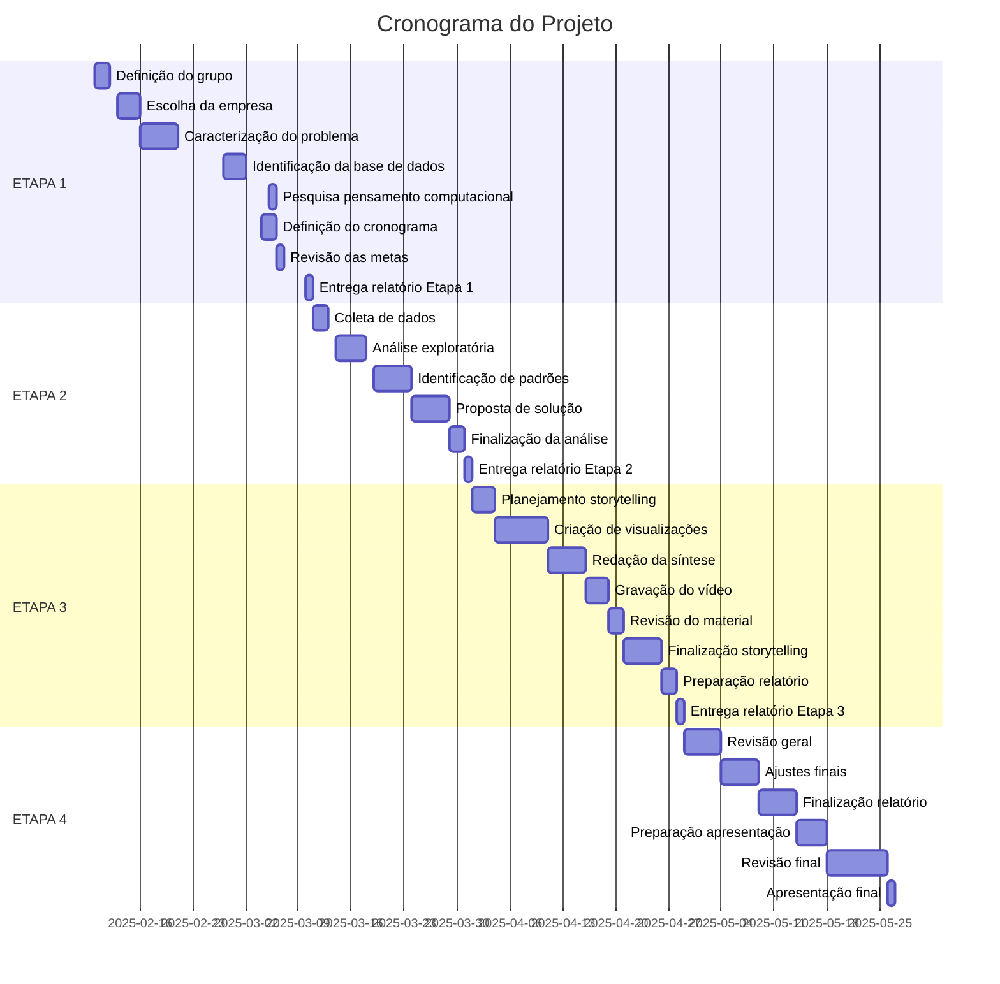

# Projeto Ciência de Dados - Mackenzie (Cronograma Detalhado)

## Visão Geral

Este cronograma detalha as atividades previstas para o projeto de análise de dados, dividido em 4 etapas com datas específicas e responsáveis por cada atividade.

## ETAPA 1 – Planejamento Inicial (20 dias)

**Primeira entrega: 3 de março**

| **Período** | **Atividades** | **Responsável** |
| --- | --- | --- |
| 10/02 - 12/02 | Definição do grupo e distribuição de tarefas | Todos |
| 13/02 - 15/02 | Escolha da empresa e contexto organizacional | Enzo Ferroni |
| 16/02 - 21/02 | Caracterização do problema | Vinícius Sabiá |
| 27/02 - 03/03 | Identificação da base de dados | Daniel dos Santos |
| 05/02 - 05/02 | Pesquisa sobre pensamento computacional | Hudson Carvalho |
| 04/03 - 05/03 | Definição do cronograma de atividades | Vinícius Sabiá |
| 06/03 - 07/03 | Revisão das metas e objetivos | Daniel dos Santos |
| 10/03 | Preparação e entrega do relatório da Etapa 1 | Todos |

## ETAPA 2 – Definição do Produto (28 dias)

**Segunda entrega: 31 de março**

| **Período** | **Atividades** | **Responsável** |
| --- | --- | --- |
| 11/03 - 13/03 | Coleta e organização dos dados | Daniel dos Santos |
| 14/03 - 18/03 | Análise exploratória de dados (EDA) | Enzo Ferroni |
| 19/03 - 23/03 | Identificação de padrões e insights | Vinícius Sabiá |
| 24/03 - 28/03 | Elaboração da proposta de solução analítica | Hudson Carvalho |
| 29/03 - 30/03 | Finalização da análise exploratória | Enzo Ferroni |
| 31/03 | Preparação e entrega do relatório da Etapa 2 | Todos |

## ETAPA 3 – Storytelling (28 dias)

**Terceira entrega: 28 de abril**

| **Período** | **Atividades** | **Responsável** |
| --- | --- | --- |
| 01/04 - 03/04 | Planejamento do Data Storytelling | Vinícius Sabiá |
| 04/04 - 10/04 | Criação de visualizações e gráficos | Hudson Carvalho |
| 11/04 - 15/04 | Redação da síntese dos resultados | Daniel dos Santos |
| 16/04 - 18/04 | Gravação do vídeo de 5 minutos | Todos |
| 19/04 - 20/04 | Revisão do material de apresentação | Enzo Ferroni |
| 21/04 - 25/04 | Finalização do Data Storytelling | Todos |
| 26/04 - 27/04 | Preparação do relatório da Etapa 3 | Todos |
| 28/04 | Entrega do relatório da Etapa 3 | Todos |

## ETAPA 4 – Encerramento (28 dias)

**Quarta e última entrega: 26 de maio**

| **Período** | **Atividades** | **Responsável** |
| --- | --- | --- |
| 29/04 - 03/05 | Revisão geral do relatório final | Todos |
| 04/05 - 08/05 | Ajustes finais na análise e storytelling | Enzo Ferroni |
| 09/05 - 13/05 | Finalização do relatório final | Daniel dos Santos |
| 14/05 - 17/05 | Preparação para a apresentação | Vinícius Sabiá |
| 18/05 - 25/05 | Revisão final e ajustes | Todos |
| 26/05 | Apresentação dos resultados e entrega final | Todos |

## Linha do Tempo

## Divisão de Responsabilidades

| **Membro da Equipe** | **Responsabilidades** |
| --- | --- |
| Enzo Ferroni | • Escolha da empresa e contexto organizacional• Análise exploratória de dados (EDA)• Ajustes finais na análise e storytelling |
| Vinícius Sabiá | • Caracterização do problema• Definição do cronograma de atividades• Planejamento do Data Storytelling• Revisão do material de apresentação• Preparação para a apresentação |
| Daniel dos Santos | • Identificação da base de dados• Redação da síntese dos resultados• Finalização do relatório final |
| Hudson Carvalho | • Criação de visualizações e gráficos • Elaboração da proposta de solução analítica• Pesquisa sobre pensamento computacional • Finalização do relatório final |

## Marcos Importantes

| **Marco** | **Data Prevista** |
| --- | --- |
| Entrega do Relatório da Etapa 1 | 10/03/2025 |
| Entrega do Relatório da Etapa 2 | 31/03/2025 |
| Entrega do Relatório da Etapa 3 | 28/04/2025 |
| Entrega do Relatório Final e Apresentação | 26/05/2025 |
